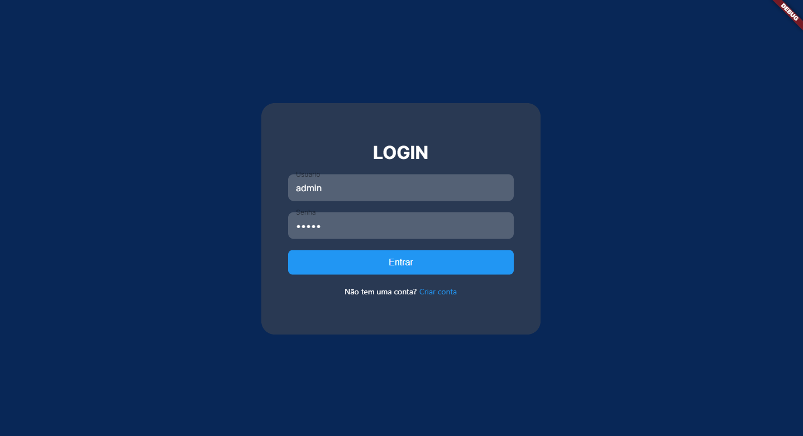
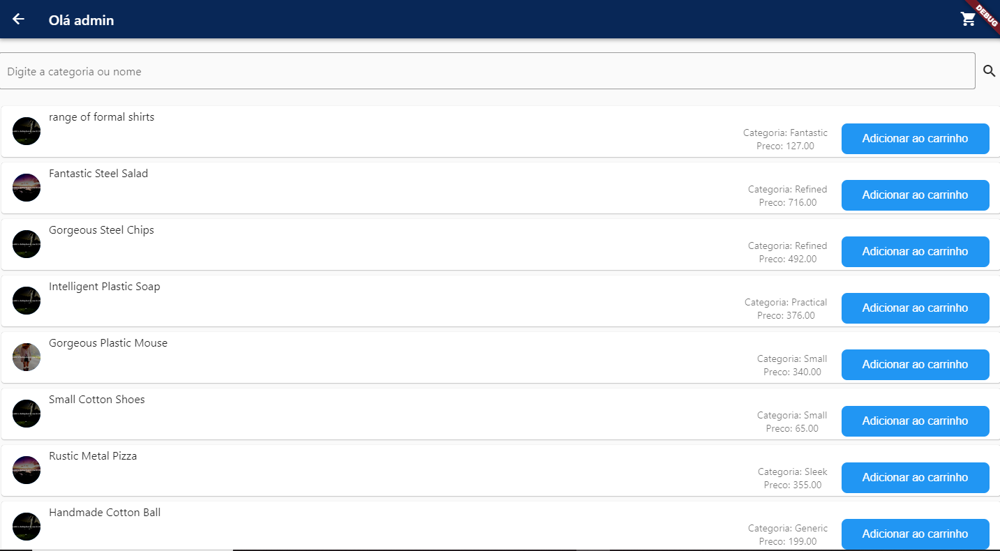
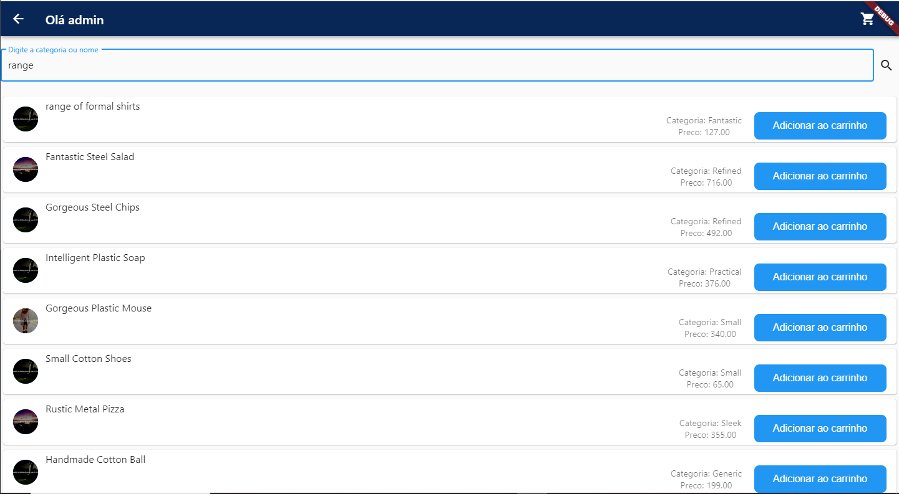
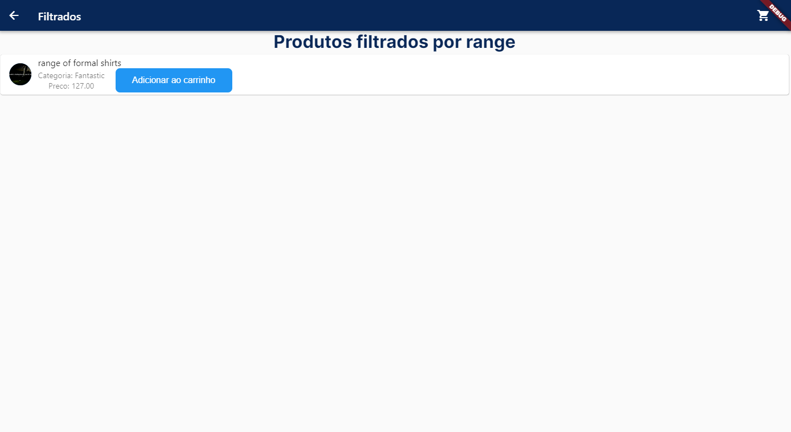
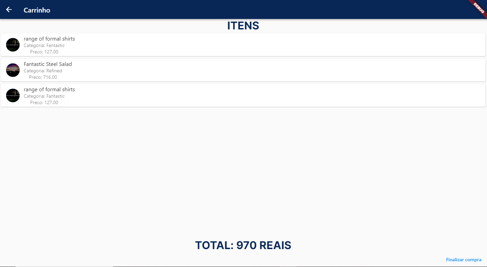

# NodeShopFront

 [Clique aqui para ver a API usada nesse projeto](https://github.com/yan-moura19/NodeShop)
 
* 1 - Guia de instalação do projeto
* 2 - Detalhamento do projeto
* 3 - Telas


## 1 - Instalação do projeto
### Instalar dependencias do projeto

```
 abrir o arquivo pubspec.yaml e salvar (CTRL + S) o arquivo para que os plugins/dependencias sejam baixados
```
### Rodar aplicação
```
flutter run --web-renderer html
```

## 2 - Instalação do projeto
* package pages = Arquivos com as paginas do projeto
* package widgets = Componentes do projeto
* routes.dart = Rotas nomeadas

## 3 - Telas
### Login
#### Fluxo da aplicação
* Imagem 1 - Login Digite qualquer usuario, mas a senha deve ser 'admin'.
* Imagem 2 - Produtos listados.
* Imagem 3 - Adicionar ao carrinho, clicando no botão "Adicionar ao carrinho" (Pode voltar as compras ou ir para o carrinho).
* Imagem 4 - Digitando o nome ou categoria de um produto para filtrar.
* Imagem 5 - Depois de clicar no icone de lupa para pesquisar o produto.(Caso não encontre nenhum produto aparece um texto informando que não foi encontrado nenhum produto)
* Imagem 6 - Tela de carrinho, pode Finalizar a compra ou voltar para adicionar mais produtos.
* Imagem 7 - Depois de clicar em finaliza compra.


### Imagem 1
 
 
 ### Imagem 2
 
 
 ### Imagem 3
 
 
 ### Imagem 4
 
 
 ### Imagem 5
 
 
  ### Imagem 6
 
 
  ### Imagem 7
 
